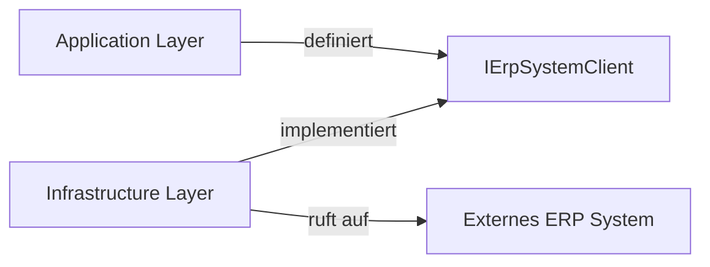

# C# Interface für den Anti-Corruption Layer (ACL) zum ERP

Dieses Dokument beschreibt das Design und die Verwendung des C# Interfaces, das als Anti-Corruption Layer (ACL) zwischen unserer modernen Web-Applikation und dem externen ERP-System dient.

## 🎯 Ziel & Zweck

Ein **Anti-Corruption Layer (ACL)** isoliert das Domänenmodell unserer Anwendung von einem externen System (hier: ERP), dessen Modell oder API unpassend, veraltet oder komplex ist.

**Vorteile:**
*   **Entkopplung:** Die Applikationslogik hängt nicht direkt von den ERP-Datentypen oder API-Details ab.
*   **Übersetzung:** Das Interface nutzt unsere sauberen Domänen-Objekte (`Domain Entities` oder `DTOs`). Der ACL übersetzt diese im Hintergrund in die ERP-spezifischen Strukturen.
*   **Austauschbarkeit:** Das ERP-System kann theoretisch ausgetauscht werden, ohne dass die Kernlogik der Applikation angepasst werden muss. Nur die Implementierung des Interfaces ändert sich.

## 🏗 Architektur

Das Interface wird im **Application Layer** definiert, die konkrete Implementierung befindet sich im **Infrastructure Layer** (Dependency Inversion Principle).



## 💻 Interface Definition

Das Interface definiert die Geschäftsoperationen, die wir vom ERP benötigen, in der Sprache unserer Domäne.

Beispiel `IErpService.cs`:

```csharp
using MyPortfolio.Domain.Entities;
using MyPortfolio.Domain.Enums;

namespace MyPortfolio.Application.Common.Interfaces;

/// <summary>
/// Abstraktes Interface für die Kommunikation mit dem ERP-System.
/// Dient als Anti-Corruption Layer.
/// </summary>
public interface IErpService
{
    /// <summary>
    /// Prüft den Lagerbestand eines Artikels im ERP.
    /// </summary>
    Task<int> GetStockLevelAsync(string sku, CancellationToken cancellationToken = default);

    /// <summary>
    /// Übermittelt eine Bestellung an das ERP.
    /// </summary>
    /// <returns>Die Bestellnummer aus dem ERP.</returns>
    Task<string> SubmitOrderAsync(Order order, CancellationToken cancellationToken = default);

    /// <summary>
    /// Synchronisiert Kundenstammdaten.
    /// </summary>
    Task SyncCustomerDataAsync(Customer customer, CancellationToken cancellationToken = default);
}
```

## 🧩 Implementierungsbeispiel (Infrastructure)

Die Implementierung übersetzt unsere Objekte in die ERP-API-Aufrufe (z.B. SOAP, REST, RFC).

```csharp
public class SapErpService : IErpService
{
    private readonly ISapHttpClient _client;

    public SapErpService(ISapHttpClient client)
    {
        _client = client;
    }

    public async Task<string> SubmitOrderAsync(Order order, CancellationToken ct)
    {
        // 1. Mapping: Domain Order -> SAP BAPI Struktur
        var sapOrder = new SapOrderDto 
        {
            Kunnr = order.CustomerId,
            Matnr = order.Items.First().Sku,
            Menge = order.Items.First().Quantity
        };

        // 2. Call: Externer Aufruf
        var response = await _client.CreateOrderAsync(sapOrder, ct);

        // 3. Mapping: SAP Response -> Domain Return Type
        return response.Vbeln; // ERP Bestellnummer
    }
}
```

## 🚀 Verwendung (Application)

In einem Command Handler nutzen wir nur das Interface und wissen nichts von SAP oder XML.

```csharp
public class CreateOrderHandler : IRequestHandler<CreateOrderCommand, string>
{
    private readonly IErpService _erpService;

    public CreateOrderHandler(IErpService erpService)
    {
        _erpService = erpService;
    }

    public async Task<string> Handle(CreateOrderCommand request, CancellationToken ct)
    {
        // ... Logik ...
        
        // Aufruf über ACL - keine Abhängigkeit zu ERP-Details
        var erpOrderId = await _erpService.SubmitOrderAsync(order, ct);
        
        return erpOrderId;
    }
}
```
